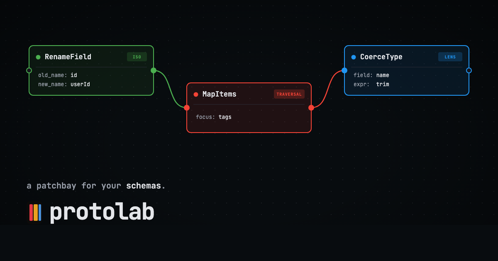

<p align="center">
  
</p>

# protolab

A visual editor for bidirectional data transformations. Built on [panproto].

protolab draws schema migrations as patch circuits. Nodes are lens
components; wires are typed bidirectional signals. Forward evaluation
(`get`) transforms input to output; backward evaluation (`put`) propagates
edits made on the output back through the composed lens to the input.

Live at **<https://panproto.dev/protolab/>**

## Components

Nine components cover the common schema migration idioms. Optic class is
fixed per component and determines the wire color.

| Component      | Optic     | Purpose                                                 |
|----------------|-----------|---------------------------------------------------------|
| `RenameField`  | Iso       | Rename a field. Lossless both directions.               |
| `AddField`     | Lens      | Introduce a field with a default; `put` drops it.       |
| `DropField`    | Lens      | Drop a field; its value lives in the complement.        |
| `HoistField`   | Lens      | Promote a nested field into a parent.                   |
| `NestField`    | Lens      | Inverse of HoistField.                                  |
| `CoerceType`   | Lens      | Transform a field through a `panproto-expr` + inverse.  |
| `ApplyExpr`    | Lens      | Same shape as CoerceType; preserves the field's type.   |
| `ComputeField` | Lens      | Derive a new field from an expression over others.      |
| `MapItems`     | Traversal | Apply the downstream lens to each item of an array.     |

Composing components composes their optic classes via the optics lattice —
an Iso into a Lens is a Lens; a Prism into a Lens is Affine; and so on.
The classification is recomputed on every edit by walking the underlying
panproto protolens chain.

## Running it

### Hosted

<https://panproto.dev/protolab/>

### Locally

Requires Rust 1.85+, Node 20+, and [wasm-pack].

```bash
git clone https://github.com/panproto/protolab
cd protolab
./scripts/build-wasm.sh     # ~3 min first build
cd app && npm install && npm run dev
```

Rust changes need a rebuild of the WASM bundle (`./scripts/build-wasm.sh`).
The React layer hot-reloads.

## Presentation mode

protolab borrows Max/MSP's *edit mode* vs. *presentation mode* split. The
circuit is always the source of truth; presentation mode hides the palette
and inspector and renders a curated subset of components as a form.

`Cmd+E` (or `Ctrl+E`) toggles. The default hosted URL loads a Lexicon
Mapper — paste an atproto NSID, resolve it, run the mapping.

Presentation metadata (`presentation:include`, `presentation:widget`,
`presentation:x/y`, `presentation:column`) lives on the circuit schema as
constraints, so it round-trips through every import and export path.

## Protocols

protolab speaks every protocol [panproto] speaks: JSON Schema, OpenAPI,
Avro, Parquet, CDDL, FHIR, GeoJSON, AT Proto, MongoDB, and the rest,
plus any custom protocol registered at runtime via the Protocol editor.

## Layout

```text
crates/
  protolab-schema/   Circuit protocol on top of panproto-schema
  protolab-core/     Topological sort, type checking, lens DSL I/O
  protolab-eval/     Forward + backward evaluator
  protolab-wasm/     wasm-bindgen boundary for the frontend
app/                 Vite + React 19 + React Flow UI
grammars/            panproto-expr grammars (TextMate, tree-sitter)
schemas/             Nickel component contracts
```

Each crate is a thin wrapper over panproto. Most panproto releases land in
protolab as a `Cargo.toml` tag bump and a few lines of glue.

## Tests

```bash
cargo test --workspace      # Rust
cd app && npm test          # Frontend unit + component (vitest)
cd app && npm run test:e2e  # Playwright against the dev server
```

## Contributing

See [CONTRIBUTING.md](CONTRIBUTING.md).

## License

MIT. See [LICENSE](LICENSE) and [NOTICE](NOTICE).

## Related

- [panproto]: schemas, lenses, protolenses, theories, evaluation, and the
  protocol zoo. protolab is the UI on top.
- [Cambria]: Ink & Switch's lens-based JSON schema evolution; the
  direct inspiration for panproto's migration layer.
- [Max/MSP]: patch cables, hot/cold ports, per-object bang.
- [React Flow]: the canvas primitives.

[panproto]: https://github.com/panproto/panproto
[wasm-pack]: https://rustwasm.github.io/wasm-pack/installer/
[Cambria]: https://www.inkandswitch.com/cambria/
[Max/MSP]: https://cycling74.com/products/max
[React Flow]: https://reactflow.dev/
